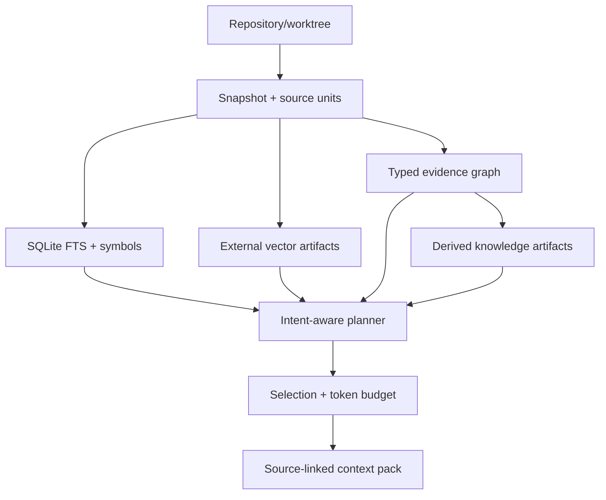

# Architecture

## Invariants

The repository snapshot is immutable base data. A snapshot is identified by repository identity, base revision, workspace overlay hash, and index profile hash. Lexical, structural, dense, history, and knowledge views are independently materialized and independently fresh.

SQLite owns identities, manifests, source addresses, entities, relations, retrieval-document metadata, occurrences, FTS postings, invalidations, artifact references, and trajectory metadata. It does not own large source archives, vector matrices, model weights, generated knowledge bodies, or raw traces.

External payloads use a content-addressed artifact store:

```text
.cce/
  metadata.sqlite
  artifacts/
    blake3/<prefix>/<digest>
  index.lock
  tmp/
```

An artifact is written to a temporary file, flushed, atomically renamed, and then referenced from a SQLite transaction. Orphan artifacts are harmless and garbage-collectable; a committed metadata reference never points to a partially written payload.

## Data flow



## Trust levels

1. compiler or SCIP resolved fact
2. syntax/parser fact
3. framework-rule derived relation
4. model-inferred semantic relation

Every relation stores its origin, confidence, evidence, extractor version, and valid snapshot. Query policies may require a minimum trust level.

Path containment is a deterministic structural fact recorded with extractor identity. Tree-sitter facts are syntax-level. Relative imports are framework-derived and intentionally remain below compiler/SCIP facts. Knowledge and commit-message documents participate in retrieval but cannot create authoritative call or dataflow edges.

## Freshness and concurrency

The current snapshot pointer changes only in the same SQLite transaction that commits all metadata references. File analysis is reused when path, content hash, language, and cache-format version match the prior current snapshot. A cross-process filesystem lease permits a single writer; readers continue using the last complete snapshot. `status` is read-only and marks usable views stale when the worktree snapshot differs.

SQLite runs in WAL mode with foreign keys and a bounded busy timeout. Payload files are immutable. Failed indexing may leave unreferenced content-addressed objects, but cannot expose a partially complete snapshot.

## Serving boundary

The engine is exposed through one Rust service API. CLI, MCP, HTTP, Web, and Agent Skills are adapters. They must not build private indexes or invent a second context format.
