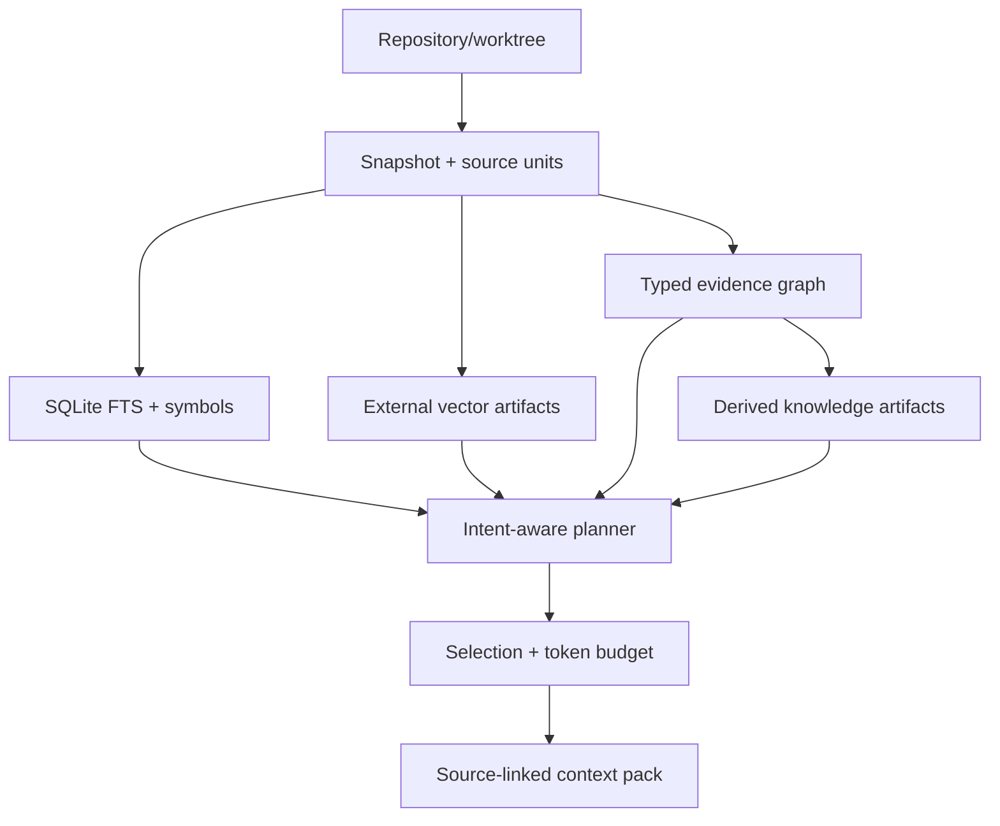

# Architecture

## Invariants

The repository snapshot is immutable base data. A snapshot is identified by repository identity, base revision, workspace overlay hash, and index profile hash. Lexical, structural, dense, history, and knowledge views are independently materialized and independently fresh.

SQLite owns identities, manifests, source addresses, entities, relations, retrieval-document metadata, occurrences, FTS postings, invalidations, artifact references, and trajectory metadata. It does not own large source archives, vector matrices, model weights, generated knowledge bodies, or raw traces.

External payloads use a content-addressed artifact store:

```text
.cce/
  metadata.sqlite
  artifacts/
    blake3/<prefix>/<digest>
  index.lock
  tmp/
```

An artifact is written to a temporary file, flushed, atomically renamed, and then referenced from a SQLite transaction. Orphan artifacts are harmless and garbage-collectable; a committed metadata reference never points to a partially written payload.

## Data flow



## Trust levels

1. source-aligned static-analysis dataflow or compiler/SCIP resolved fact
2. syntax/parser fact
3. framework-rule derived relation
4. model-inferred semantic relation

Every relation stores its origin, confidence, evidence, extractor version, and valid snapshot. Query policies may require a minimum trust level.

Path containment is a deterministic structural fact recorded with extractor identity. Tree-sitter facts are syntax-level. Relative imports are framework-derived and intentionally remain below compiler/SCIP facts. Knowledge and commit-message documents participate in retrieval but cannot create authoritative call or dataflow edges.

SCIP graph generation is local and transaction-aligned. An auto-generated index is accepted only if a second repository scan produces the same snapshot identity. Supplied SCIP indexes retain precise occurrence evidence but are marked unattested because SCIP itself does not carry source content hashes.

Precise dataflow has a stricter exchange contract in `schemas/dataflow-v1.schema.json`. It binds the analyzer output to repository identity, revision, workspace overlay, file hashes, and exact source ranges. Supplied artifacts and locally generated Joern PDGs converge on this contract. The Joern adapter exports the whole local CPG as GraphML, selects only specification-defined `REACHING_DEF` (DDG) and `CDG` edges, source-aligns their nodes, and records the detected Joern version. Missing endpoints are counted and force a partial view. The dataflow query policy traverses only authoritative data/taint/control edges and refuses to manufacture a source-to-sink path from lexical or embedding similarity.

## Freshness and concurrency

The current snapshot pointer changes only in the same SQLite transaction that commits all metadata references. File analysis is reused when path, content hash, language, and cache-format version match the prior current snapshot. A cross-process filesystem lease permits a single writer; readers continue using the last complete snapshot. Query-time settings such as reranking and worker counts cannot replace a source-identical current snapshot or discard a previously built compiler graph; index-profile differences matter when explicitly building an index, while query freshness is checked against repository identity, base revision, and workspace overlay. If an existing index and the working source differ, a fresh query fails closed and requires an explicit `cce index` rather than rebuilding with query-time defaults. Callers that explicitly allow stale results receive the last complete snapshot with every hit marked unverified. `status` is read-only and marks usable views stale only when that source identity differs.

Dense rebuilds preserve exact scores while avoiding unnecessary inference. If the serving profile is unchanged, vectors whose stable retrieval-document identity exists in the previous complete snapshot are copied into the new immutable vector artifact; only misses are sent through ONNX. The index report and dense capability record the exact reuse count. A long-lived engine caches the verified, decoded artifact by digest, computes exact inner products in parallel, uses partial Top-K selection, and fetches source bodies and entity names only for the resulting candidates.

Snapshots below 50,000 retrieval documents use the parallel exact index. Larger snapshots additionally build a USearch HNSW candidate index with normalized i8 vectors, connectivity 32, build expansion 256, and search expansion 512. Vector generation remains parallel, but HNSW insertion uses one writer because repeated concurrent builds produced unstable Recall@10; this deliberately trades index-build throughput for reproducible retrieval quality. Search over-fetches `48 × Top-K` candidates and recomputes every returned score against the original f32 vector before fusion. The `CCEVEC2` envelope contains both the versioned ANN structure and exact rerank matrix; `CCEVEC1` remains readable. Approximation can therefore affect candidate recall but cannot reorder two admitted candidates with a quantized score.

Graph traversal batches every frontier into one SQLite window query per depth. The per-entity fan-out limit is applied with `ROW_NUMBER() OVER (PARTITION BY frontier entity)` so batching does not change the traversal contract or allow one high-degree node to starve another. This reduces an N+1 workload to at most the configured graph depth while retaining typed relation provenance.

Local embedding and learned reranking inference are query-time serving stages. The engine embeds a query, searches the immutable vector artifact, reranks a bounded Top-K pool when enabled, and fuses model ranks with deterministic retrieval evidence. Local weights are loaded lazily once per engine process. Concurrent first requests share an initialization lock; independently sized round-robin embedding and reranker ONNX session pools permit parallel inference without unsafely sharing mutable sessions. Session counts affect serving memory and capacity but not immutable vector identity. Model download is opt-in; explicit bundles are revision-, path-, and SHA-bound before ONNX initialization.

History is split into stable per-commit documents. Changed paths are computed with tree-to-tree Git diffs with rename similarity disabled for bounded indexing cost; a commit's document identity includes its immutable object ID, so adding a new commit does not invalidate every older history vector.

SQLite runs in WAL mode with foreign keys and a bounded busy timeout. Payload files are immutable. Failed indexing may leave unreferenced content-addressed objects, but cannot expose a partially complete snapshot.

## Serving boundary

The engine is exposed through one Rust service API. CLI, MCP, HTTP, Web, and Agent Skills are adapters. They must not build private indexes or invent a second context format.
