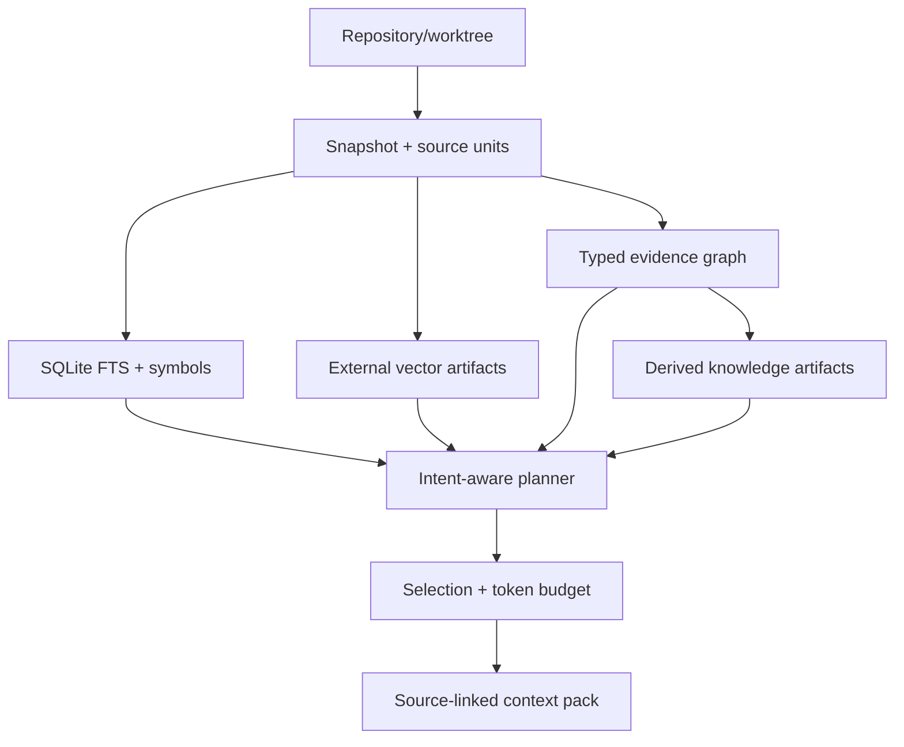

# Architecture

## Invariants

The repository snapshot is immutable base data. A snapshot is identified by repository identity, base revision, workspace overlay hash, and index profile hash. Lexical, structural, dense, history, and knowledge views are independently materialized and independently fresh.

SQLite owns identities, manifests, canonical regions, source addresses, entities, relations, retrieval-document metadata, occurrences, FTS postings, invalidations, artifact references, and trajectory metadata. It does not own large source archives, vector matrices, model weights, generated knowledge bodies, or raw traces.

A `Region` is the canonical code-range identity — a `(snapshot, path, kind, byte/line range, symbol)` tuple persisted in the `regions` table. Entities, retrieval documents, FTS rows, dense vectors, citations, and graph endpoints all join through `region_id`; path+line is never an implicit join key. Indexing emits three region granularities: file descriptors (bounded routing evidence), symbol chunks (the default retrieval unit), and AST subregions for oversized symbols. Delivery granularity stays a separate decision in the context packer.

External payloads use a content-addressed artifact store:

```text
.cce/
  metadata.sqlite
  artifacts/
    blake3/<prefix>/<digest>
  index.lock
  tmp/
```

An artifact is written to a temporary file, flushed, atomically renamed, and then referenced from a SQLite transaction. Orphan artifacts are harmless and garbage-collectable; a committed metadata reference never points to a partially written payload.

## Data flow



## Trust levels

1. compiler or SCIP resolved fact
2. syntax/parser fact
3. framework-rule derived relation
4. model-inferred semantic relation

Every relation stores its origin, confidence, evidence, extractor version, and valid snapshot. Query policies may require a minimum trust level.

Path containment is a deterministic structural fact recorded with extractor identity. Tree-sitter facts are syntax-level. Relative imports are framework-derived and intentionally remain below compiler/SCIP facts. Package boundaries come from build manifests (`Cargo.toml` workspaces, `package.json` workspaces) and carry `build_system` provenance at full confidence — `BuildDependsOn` edges are declared facts, while `Calls`/`References` from Tree-sitter stay below compiler truth. Axum `.route("path", method(handler))` bindings emit `Route` entities and `RouteHandledBy` edges as `framework_rule` facts at 0.85 confidence with call-site evidence (`cce-landmark-axum-v1`). Knowledge and commit-message documents participate in retrieval but cannot create authoritative call or dataflow edges.

Symbol identity follows the indexer's own scoping: SCIP `local <id>` spellings are unique only within their document, so a single `SymbolKey` construction — `Global(symbol)` vs `Local(document_path, symbol)` — feeds definition, reference, and `SymbolInformation.relationships` resolution; a local can never resolve to another file's entity. Tree-sitter relation dedup keys on the edge pair — `(caller, callee)` for calls (`cce-call-extract-v2`), `(source, target)` for type references (`cce-type-ref-v2`) — so distinct sources targeting one entity each emit an edge, while a repeated identical edge collapses to one. Graph materialization versions ride the index profile (`scip_ingest`, `call_edges`, `type_refs` options), so rule changes produce fresh snapshot identities rather than silently reusing stale edges.

## Architecture Atlas

`codebase_map`, `explain_component`, and `impact_analysis` serve the persisted world model directly: package entities, `Contains` membership, and `BuildDependsOn` direction from manifests; callers/references/tests from typed relation expansion with hop limits and confidence. Every answer reports its provenance; inferred component boundaries above the package level are out of scope until the deterministic layer is verified.

## Freshness and concurrency

The current snapshot pointer changes only in the same SQLite transaction that commits all metadata references. File analysis is reused when path, content hash, language, and cache-format version match the prior current snapshot. A cross-process filesystem lease permits a single writer; readers continue using the last complete snapshot. `status` is read-only and marks usable views stale when the worktree snapshot differs.

SQLite runs in WAL mode with foreign keys and a bounded busy timeout. Payload files are immutable. Failed indexing may leave unreferenced content-addressed objects, but cannot expose a partially complete snapshot.

## Serving boundary

The engine is exposed through one Rust service API. CLI, MCP, HTTP, Web, and Agent Skills are adapters. They must not build private indexes or invent a second context format.
