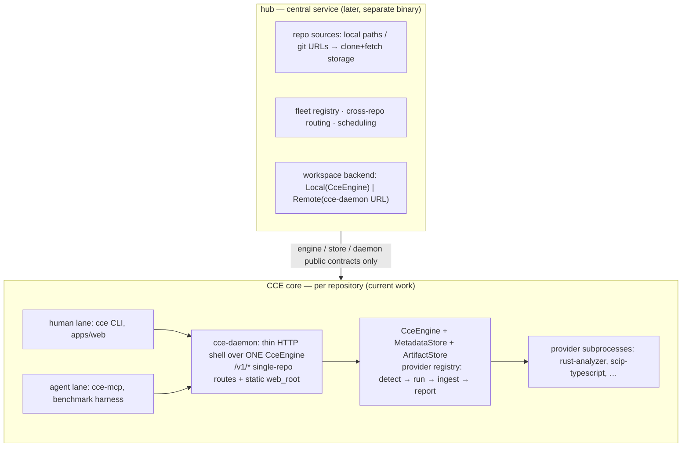

# Service architecture

Two layers, separate binaries. **CCE core** is per-repository — indexing,
retrieval, providers, one engine, one store. **Hub** is a future central
service that composes many repos through CCE's public contracts. Current
work is all in the core layer; hub is contract-shaping only.



## CCE core (per repository)

`cce-daemon` stays a thin adapter over a single `CceEngine`: loopback HTTP,
`/v1/*` routes with no repo identifier, graceful shutdown, static web
serving. It owns the repo's index lease and a serial job lane so `index`
can be asynchronous; everything snapshot-scoped lives in `<repo>/.cce/`
(SQLite + artifacts) as today.

### Provider framework

A provider is an external process that materializes or enriches a view.
Embedding models and the reranker run in-process and are *not* providers;
providers are the boundary where CCE shells out.

```rust
trait Provider {
    fn id(&self) -> &'static str;             // "scip:rust-analyzer"
    fn detect(&self, repo: &Path) -> DetectState;
    fn run(&self, ctx: &ProviderRun) -> Result<ProviderOutput>;
}

enum DetectState {
    Ready { tool: PathBuf, detail: String },
    Missing { remediation: String },
    NotApplicable { reason: String },
}
```

The `Provisionable` lane exists for `zoekt` today: `cce providers
--provision` installs the pinned toolchain (pinned upstream commit —
sourcegraph/zoekt ships no release binaries) into the managed cache
`<data>/providers/zoekt/bin`, preferring checksum-verified release assets
built by CCE CI and falling back to `go install` at the same revision.
Every other provider reports `Missing` with the exact install command
instead of silently fetching.

Lifecycle inside an index job:

1. **detect** — `CCE_*` env overrides → PATH → the managed cache
   (`<data_root>/providers/<id>/bin` for zoekt) → repo-local artifact (a
   checked-in `index.scip` counts as `Ready`, always offline).
2. **provision** — only behind an explicit `--provision` flag (the flag
   *is* the network opt-in, same pattern as `--dense local`). Pinned
   version + sha256-verified install in the data root; never at query
   time, never silently.
3. **run** — subprocess with cwd = repo, scrubbed environment, timeout,
   output to the artifact store. Providers never write SQLite.
4. **ingest** — CCE parses the artifact itself: SCIP occurrences become
   `References`/`Calls` edges at `RelationOrigin::Scip` (trust level 1),
   symbol information enriches entity signatures and hover docs. When a
   TreeSitter edge and a SCIP edge describe the same
   `(source, target, kind)`, the higher-trust origin wins the row.
5. **report** — every run ends in `view_status`: `Ready`, `Partial`
   (coverage-bounded, the gap in `message`), `Unavailable` (tool
   missing/declined, with remediation), or `Failed` (tool error, malformed
   artifact). Nothing degrades silently.

v1 registry:

| provider | produces | installer | notes |
|---|---|---|---|
| `scip:rust-analyzer` | Dataflow substrate, Graph truth | rustup component / release binary | dogfood target — this repo |
| `scip:typescript` | same | project `node_modules/.bin` → repo `.bin` → PATH | monorepo-aware: indexes the largest workspace tsconfig when the root is a solution file |
| `scip:file` | same | none | ingests a checked-in `index.scip`; always offline |
| `zoekt:index` | lexical file candidates | `cce providers --provision`, PATH, or `CCE_ZOEKT*` env | shard under `<data>/providers/zoekt/index`, snapshot-marker pinned |

SCIP supplies definition/reference/implementation truth and hover docs — it
does **not** carry taint edges. With SCIP ingested, `ViewKind::Dataflow`
moves to `Partial`; `DataflowRequired` stays unsatisfied until a
path-search layer over the resolved call graph exists.

### History evidence

Each non-root commit produces a `CommitDiff` document (message, changed
paths, identifier-carrying `+`/`-` lines, capped) plus a complete patch in
the artifact store (`ArtifactKind::CommitPatch`, digest recorded on the
`Commit` entity as `patchArtifactDigest`). The `history` view reports
`git_commit_messages` + `git_diff_hunks` capabilities. Commit documents are
owned by the `history` route — they never enter the plain `lexical` route,
and each touched file contributes at most one covering evidence address per
side. Historical payload obeys the same exclusions as the scan: sensitive
names are withheld entirely and `.cceignore`/`.gitignore`-matched paths
contribute a path note but no content or evidence.

The stored patches are themselves searchable (`type:diff`, `cce diff`,
`POST /v1/diff`): a query-time regex runs over every `CommitPatch` in the
snapshot — the same scan semantics as Sourcegraph, no new index — and hits
group per (commit, file) with post-image/pre-image line numbers. Coverage
is bounded by `HISTORY_COMMIT_LIMIT` and reported in
`missing_capabilities`; `type:commit` restricts retrieval to history
documents instead.

#### Core API

Implemented (single-repo scope):

| endpoint | backing |
|---|---|
| `GET /v1/providers` | detect states + remediation strings |
| `GET /v1/def/{sym}`, `GET /v1/refs/{sym}` | SCIP/tree-sitter resolved addresses, origin-tagged |
| `POST /v1/index` | runs the provider phase; `IndexReport.providers` carries per-provider outcomes |

`cce providers`, `cce def`, `cce refs` call these (or the engine
in-process). `cce index --no-providers` / `CCE_NO_PROVIDERS` skips the
provider phase.

| `POST /v1/grep` | worktree regex honoring ignore + sensitive-file policy; always fresh, `freshness: "worktree"` |

Query filters: `lang:`/`path:` tokens in any search query parse into
`SearchRequest.filters` (or are set directly by API callers); lexical
pushes them into the FTS join, other routes filter post-fusion. The FTS
`name` column stores identifier split/fold forms so camelCase, snake_case,
and folded spellings converge.

Planned next:

| endpoint | backing |
|---|---|
| `GET /v1/jobs` | in-flight and last index/provider job for this repo |

## Hub (central service — later)

One per machine. Owns everything that is *about repositories* rather than
*inside one*:

- **repo sources** — register a local path, or submit a git URL and hub
  clones/fetches into its own storage (`~/.cce/repos/`). Acquisition is a
  hub job; CCE only ever sees a local path.
- **fleet registry** — repo_id (hash of normalized remote URL or canonical
  path) → workspace, sync state, last indexed commit.
- **workspace backends** — `Local`: an in-process `CceEngine` per repo
  (lazy, LRU-evicted). `Remote`: proxy to a `cce-daemon` process for that
  repo, for isolation. v1 is `Local`; the per-repo daemon API is already
  the `Remote` contract.
- **cross-repo surface** — `/v1/repos`, `/v1/repos/{id}/**` proxying the
  core routes above, `/v1/jobs` fan-out, repo picker in the web UI.
- **git-source freshness** — a cloned repo's snapshot pins a commit SHA,
  which is *stronger* provenance than a worktree hash; staleness becomes
  "ref moved upstream", checked on explicit sync.

Nothing in hub touches CCE internals beyond the engine, store, and daemon
public contracts — hub-era code does not enter core crates.

## Failure taxonomy (core)

| condition | view state | user sees |
|---|---|---|
| tool absent, provision off | `Unavailable` | remediation string |
| provision declined by policy | `Unavailable` | "network opt-in required" |
| tool ran, crashed/timed out | `Failed` | exit status + stderr tail in message |
| artifact parses, partial coverage | `Partial` | which languages/paths are uncovered |
| artifact malformed/stale repo root | `Failed` | provenance of the artifact |

Every state is recorded against the snapshot and surfaces in
`missing_capabilities` at query time — the same channel that already
refuses to fake dataflow.

## Explicitly out of scope

- hub implementation (sources, fleet registry, cross-repo API) — the
  contract shape above exists so core decisions don't foreclose it
- multi-user tenancy and auth beyond loopback binding
- OS-level sandboxing of provider subprocesses (v1: env scrub + timeout;
  indexers are the repo's own language toolchains)
- fetching a project's package dependencies (`npm install`, `cargo fetch`):
  providers run against the tree as it stands and report partial coverage
- watch-mode reindex policy — the `invalidations` table is the reserved
  seam; debounce/idle policy is a separate design step
