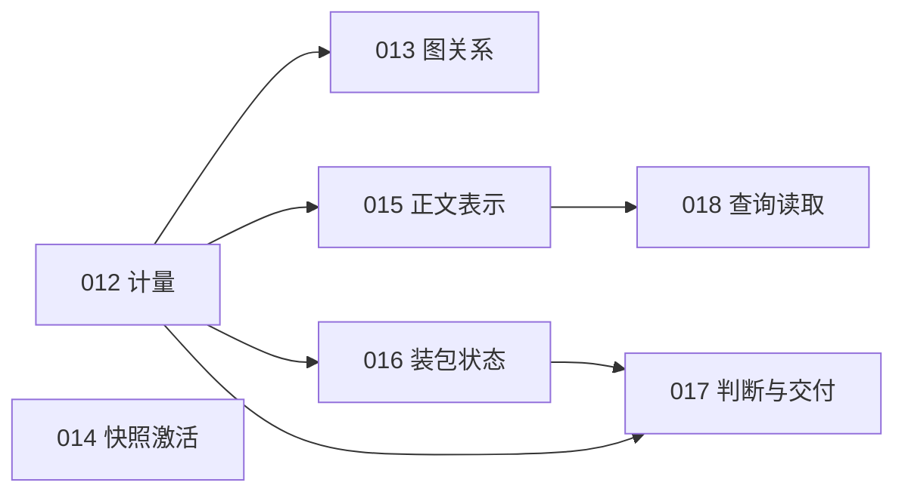

# CCE Implementation Plans

本目录记录待执行的实现计划与历史计划状态。当前内核审查基于 2026-09-19 的
`d7c2c2a` 加未提交工作区；问题证据和测量边界见
[内核问题记录](kernel-audit-2026-09-19.md)，具体输入见
[源码摘要](kernel-audit-2026-09-19.json)。本轮只记录和规划，尚未实施这些修复。

## 当前执行队列

每份计划都包含独立上下文、修改范围、验证命令、兼容性与停止条件。
S 为小时级，M 为约一天级，L 为多天；属于含测试的粗略估计。

| 计划 | 交付结果 | 优先级 | 投入 | 依赖 | 状态 |
| --- | --- | --- | --- | --- | --- |
| [012](012-evaluation-evidence-accounting.md) | item、地址、token 分开计量；符号证据限定路径 | P0 | M | — | DONE `65f7666` |
| [013](013-graph-identity-and-call-completeness.md) | SCIP local 身份隔离；不同 caller 的边不丢失 | P0 | M | 验收使用 012 | DONE `8d5e9ab` |
| [014](014-reactivate-complete-snapshot.md) | A→B→A 后 current 与所有入口一致 | P0 | S | — | DONE `4e7a765` |
| [015](015-persist-retrieval-representations.md) | dense 实际嵌入描述正文与前置注释 | P1 | M | 012 | TODO |
| [016](016-commit-packing-state-on-admission.md) | 被拒绝候选不消耗 packing 配额 | P1 | S | 验收使用 012 | TODO |
| [017](017-preserve-verdict-through-context.md) | context 保留 search verdict 与交付缺口 | P1 | M | 012、016 | TODO |
| [018](018-dense-query-materialization.md) | 缓存已验证向量索引，只读取 dense 命中文档 | P1 | M | 012、015 | DONE `2be4811` |
| [019](019-structural-pattern-search.md) | `pat:` 结构模式算子：regex 预筛 + tree-sitter CST 匹配 | P1 | M | 无硬依赖；与 015/018 共改 retrieval | TODO |

推荐顺序为 **012 → 013 → 014 → 015 → 016 → 017 → 018**。
019 属功能对齐（对标 Sourcegraph F2），不在正确性链上，可与上述并行设计。
正确性 fixture 可以独立编写；质量 A/B 先统一计量。实现不能以增加模型规模或调排序参数
替代已确认的身份、正文和状态错误。



图表示硬依赖与验收依赖，不表示可以在共享工作区并发编辑。
013/015 都修改 profile；014/015/018 都涉及 engine/store；016/017 都涉及 context。
执行前比较实时源码、计划 excerpts 和摘要，保留已有未提交改动。
完成后更新本表状态；不要仅因代码已写就标 DONE，计划中的验证仍须完成。

## 历史计划与重核状态

001–011 的 DONE 继承既有记录，本次未重新执行其验收。STALE 表示文档不再可直接执行，
不表示代码未实现，也不表示原目标已全部完成。

| 计划 | 原范围 | 状态 | 当前处理 |
| --- | --- | --- | --- |
| [001](001-benchmark-harness-dense-passthrough.md) | dense/model 参数与 engine latency | DONE | 新计量契约由 012 接续 |
| [002](002-atlas-direct-snapshot-resolution.md) | Atlas 直接解析 snapshot | DONE | 历史快照激活问题独立由 014 修复 |
| [003](003-dataset-v5-vocab-gap-budget-curve.md) | vocab-gap、预算与 dataflow 用例 | DONE | 保留数据 lineage；修订 gold 必须独立裁决 |
| [004](004-embedding-model-ladder-paired-comparison.md) | embedding 模型阶梯比较 | DONE | Qwen3 未进入原矩阵；015 修正正文后重新比较 |
| [005](005-task-to-component-recall-metric.md) | Task→Component 指标 | DONE | 不等于符号／事实／任务成功率 |
| [006](006-framework-landmark-axum-routes.md) | axum route landmarks | DONE | 保留 framework provenance |
| [007](007-graph-flow-parity.md) | 统一 graph flow 替代 legacy priors | DONE | 013 修其输入图，不重调传播数学 |
| [008](008-evidence-paths-abstention.md) | evidence paths、拒答、消歧 | STALE | 路径与 SearchVerdict 已存在；交付缺口由 017 接续，拒答门禁须重验 |
| [009](009-world-model-surface.md) | operators、dataflow、federation | STALE | 部分 surface 已存在；不得照原文将 call reachability 提升为精确 taint |
| [010](010-gateway-infra.md) | gateway、fan-out、push | DONE | 本轮不重复实施；未重跑服务验收 |
| [011](011-infra-resilience.md) | 指标、熔断、背压、singleflight | DONE | 本轮不重复实施；未重跑服务验收 |

状态：TODO、IN PROGRESS、DONE、BLOCKED（具体阻塞）、STALE（文档需重核）、
REJECTED（明确理由）。当前计划不授权 executor 自动 push、合并或发布。

## 共同验证约束

每份计划内都列有可独立执行的具体命令。Rust 变更完成时必须运行：

```bash
cargo fmt --all -- --check
cargo clippy --workspace --all-targets --all-features -- -D warnings
cargo test --workspace --all-features
```

涉及 retrieval、storage、parsing、packing 时运行 self-index smoke。
benchmark 前执行 `cargo build --release -p cce-cli -p cce-daemon`，daemon adapter 使用
CLI 的 sibling binary；只重建 CLI 会测到旧 daemon。构建与 provider benchmark 串行执行。

正式比较固定被索引源码语料、gold、预算、模型和 adapter；只切换待比较的实现。
每侧记录 engine 二进制和语料摘要，索引按 materialization profile 隔离。
`WORKTREE` 产物仅能作为本地 smoke，除非另有完整冻结与归因记录。
研究产物位于 gitignored `research/output/`，新文件不得覆盖旧基线。
具体冻结未提交语料、保存两套 binary、生成 adapter 和执行 compare 的命令见
[固定语料配对操作](kernel-paired-benchmark.md)。各计划内 `. WORKTREE` 命令只作 smoke。

dense local 是 frontend 默认，首次索引可能下载模型，需披露该行为。
无网络、无模型时 `dense: disabled` 的 lexical/structural 验证必须继续可用。
所有事实保留 canonical source、snapshot、freshness、route、score、provenance。

## 后续方向

当前先修内核契约。后续按独立问题定义与实验证据决定范围：

| 方向 | 前置证据或决策 |
| --- | --- |
| SCIP 产物与源码版本绑定 | 旧 index.scip 对新源码的反例、内容摘要清单与降级契约 |
| strict freshness 的扫描策略 | 同长度／同 mtime 编辑 fixture，以及每次哈希的成本 |
| 外部 sparse 查询 profile | FTS、flow、witness、index 各阶段的真实耗时 |
| Atlas entity/edge 评测 | map/explain/impact 专用案例与图 gold，不能借用 file recall |
| synthetic architecture corpus | 固定 planted graph 和组件边界，用于测 component F1 |
| L3 component inference | 先验证确定性关系与组件评测，再引入语义聚类 |
| agent 任务与轨迹评测 | 轨迹采集边界和成本；测解决率、错误探索、首个正确组件耗时 |
| qualified-symbol witness | Type::method 所属关系 fixture；不能只证明两段名称存在 |

原 roadmap 的背景来源为本地 gitignored
`research/papers/architecture_first_code_context_engine_report.pdf`。
本目录当前问题的独立证据以源码和 [审查记录](kernel-audit-2026-09-19.md) 为准，
执行当前计划不要求取得该 PDF。

已考虑但不采用的路径集中记录在
[审查记录的相应章节](kernel-audit-2026-09-19.md#已考虑但本轮不采用)，避免重复审查。
